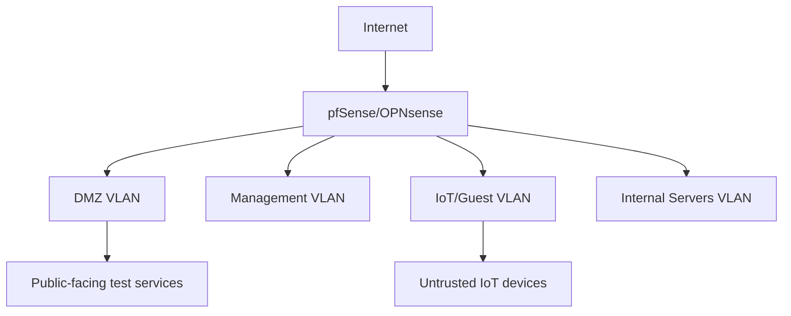

# 🗺️ Segmented Network Design

## Threat Model
- DMZ isolated from internal VLANs — assumed compromised
- IoT/Guest fully isolated from Management and Servers
- All inter-VLAN traffic logged and inspected via IDS
